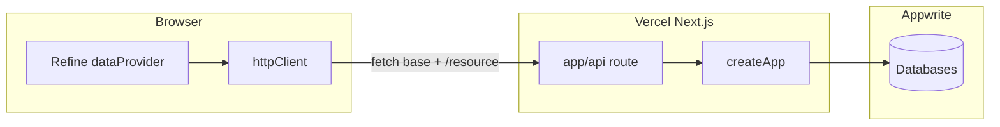

# Applicant Tracking Dashboard

Applicant Tracking Dashboard built with **Refine + Next.js**, integrated with a real **REST API** layer backed by **Appwrite**.

## Tech Stack

- Frontend: Next.js (App Router), Refine, Ant Design
- Backend API: Hono (local Node server + Vercel serverless under `/api`)
- Database: Appwrite (Databases + Collections)
- Data Fetching/Server State: Refine + React Query

## Features Implemented

- Applicant resource:
  - List, create, edit, show, delete
  - Search + status filter
  - Sorting + server-side style pagination params
- Interview resource:
  - List interviews
  - Create interview from applicant detail page
  - Filter interviews by applicant (`applicantId`)
- Dashboard page:
  - Total applicants
  - Applicants grouped by status
  - Recent applicants
  - Upcoming interviews
- Lightweight access control:
  - Mocked roles: `admin`, `recruiter`, `interviewer`
  - UI and action-level permission checks
- UX expectations:
  - Loading states
  - Error handling
  - Success notifications

## API Endpoints

The API is mounted at **`/api`** (same paths as before, prefixed with `/api`):

- Applicants:
  - `GET /api/applicants`
  - `GET /api/applicants/:id`
  - `POST /api/applicants`
  - `PUT /api/applicants/:id`
  - `DELETE /api/applicants/:id`
- Interviews:
  - `GET /api/interviews`
  - `POST /api/interviews`
  - `GET /api/interviews?applicantId=...`
- Health: `GET /api/health`

List queries support:
- Pagination: `page`, `limit`
- Sorting: `sortBy`, `order`
- Filtering: `status`, `q`, `applicantId`

## Project Structure

- `src/providers/dataProvider.ts` - Refine data provider mapped to REST API
- `src/providers/authProvider.ts` - mocked role auth
- `src/providers/accessControlProvider.ts` - role-based action rules
- `src/app/page.tsx` - dashboard
- `src/app/applicants/*` - applicant list/create/edit/show flows
- `src/app/interviews/page.tsx` - interview listing
- `backend/app.js` - shared Hono app (routes + Appwrite)
- `backend/server.js` - local dev server (`@hono/node-server`)
- `src/app/api/[[...route]]/route.ts` - Vercel serverless entry (Node runtime)
- `backend/APPWRITE_SETUP.md` - Appwrite collection/attribute/index guide

## Getting Started

### 1) Frontend setup

```bash
npm install
cp .env.example .env.local
```

Copy [`.env.example`](.env.example) and set `NEXT_PUBLIC_API_URL` (the data layer calls `/applicants`, `/interviews`, etc. relative to this base; values are normalized to end with `/api` when you omit it on `localhost:4000`).

Typical local values:

```bash
NEXT_PUBLIC_API_URL=http://localhost:4000/api
```

For **same-origin** local Next only (API via Next route handler, no separate backend process):

```bash
NEXT_PUBLIC_API_URL=http://localhost:3000/api
```

Run frontend:

```bash
npm run dev
```

### 2) Backend setup

```bash
cd backend
npm install
cp .env.example .env   # see backend/.env.example
npm run dev
```

Fill backend `.env` with your Appwrite values:

- `APPWRITE_ENDPOINT`
- `APPWRITE_PROJECT_ID`
- `APPWRITE_API_KEY_V2`
- `APPWRITE_DATABASE_ID`
- `APPWRITE_APPLICANTS_COLLECTION_ID`
- `APPWRITE_INTERVIEWS_COLLECTION_ID`

Optional CORS (comma-separated origins) when the browser origin is not the same as the API (e.g. custom domains):

- `CORS_ORIGINS=https://your-app.com,https://www.your-app.com` (comma-separated; the request `Origin` must match an entry exactly or the browser will block the response)

Then open:

- [http://localhost:3000](http://localhost:3000)

## Deploy to Vercel

Use **one Vercel project** linked to the repository root (the Next.js app). The Hono API runs in the same deployment via [`src/app/api/[[...route]]/route.ts`](src/app/api/[[...route]]/route.ts) (Node.js runtime, `node-appwrite`). There is a single **Environment Variables** list; split “frontend vs backend” by **naming** (`NEXT_PUBLIC_*` is exposed to the browser; everything else is server-only).



### 1) Server-only variables (never `NEXT_PUBLIC_`)

In **Vercel → Project → Settings → Environment Variables**, add the same names as in [`backend/.env.example`](backend/.env.example). Enable each for the right **Environments** (checkboxes: Production, Preview, Development):

| Variable | Notes |
| --- | --- |
| `APPWRITE_ENDPOINT` | |
| `APPWRITE_PROJECT_ID` | |
| `APPWRITE_API_KEY_V2` | Secret; rotate if exposed |
| `APPWRITE_DATABASE_ID` | |
| `APPWRITE_APPLICANTS_COLLECTION_ID` | |
| `APPWRITE_INTERVIEWS_COLLECTION_ID` | |
| `CORS_ORIGINS` | Optional. Comma-separated **exact** `Origin` values. Use when the UI is on a **different** host than the API (split deploy or local UI → prod API). Same-origin `/api` on Vercel usually does **not** need this. |

Also add these for **Preview** (and **Development** if you use `vercel dev`) so PR deployments and local `vercel dev` do not miss Appwrite config.

### 2) Browser / build: `NEXT_PUBLIC_API_URL`

Configured in [`src/lib/http.ts`](src/lib/http.ts). Rebuild after changing it (value is inlined at build time).

- **Recommended on Vercel** (API on this deployment under `/api`): set `NEXT_PUBLIC_API_URL` to **`/api`**. Relative base works for Production and every `*.vercel.app` preview without a different URL per deployment.
- **Alternative:** absolute URL, e.g. `https://your-domain.com/api`, if the UI always calls a fixed API host (including a **second** Vercel project or subdomain).

### 3) Preview vs production data

Use the same variable **names** in Vercel with **different values** per environment scope:

- **Production** — production Appwrite project/database/collections if you isolate prod data.
- **Preview** — either point at the **same** Appwrite stack as local dev (simplest) or a dedicated **staging** Appwrite project (recommended if PRs must not touch production data).
- **Development** — mirror what you need for `vercel dev` (often same as Preview).

### 4) Deploy checklist

1. Create the Vercel project from the repo root.
2. Add all **server-only** Appwrite variables for **Production** and **Preview** (and **Development** if applicable).
3. Set **`NEXT_PUBLIC_API_URL=/api`** for same-origin (or an absolute `/api` URL if the API is elsewhere).
4. Deploy. Route: [`src/app/api/[[...route]]/route.ts`](src/app/api/[[...route]]/route.ts).

Optional: run `vercel env pull` for local `vercel dev` (treat secrets carefully).

### Optional: two Vercel projects (API separate from UI)

If the API is deployed elsewhere: frontend project sets `NEXT_PUBLIC_API_URL` to that API’s `/api` URL; API project holds Appwrite secrets and **`CORS_ORIGINS`** must list every frontend origin (production, previews, `http://localhost:PORT`) with **exact** matches, per [`backend/app.js`](backend/app.js).

## Appwrite Setup

Detailed collection/index setup is documented in:
- `backend/APPWRITE_SETUP.md`

## Architecture Notes

- Refine handles server-state and CRUD mutations through a centralized `dataProvider`.
- The frontend remains mostly resource-driven, with page-level hooks (`useTable`, `useList`, `useOne`, `useCreate`, `useUpdate`, `useDelete`).
- Role checks are abstracted into `accessControlProvider` so permission logic is not duplicated in every component.
- The Hono API keeps Appwrite concerns out of the frontend, enabling consistent endpoint shape and deployment to Vercel serverless or a standalone Node process.

## API Integration Approach

- The app uses a small `fetch` client configured by `NEXT_PUBLIC_API_URL` (see `src/lib/http.ts`).
- `dataProvider` converts Refine pagination/filter/sorter contracts to REST query parameters.
- API list responses are normalized to Refine’s expected `{ data, total }` format.
- Success/error notifications are surfaced from mutation callbacks for clear user feedback.

## Challenges Encountered

- Aligning Refine table/query contracts with backend query parameter conventions.
- Keeping role-based guards simple (mocked) while still showing proper action restrictions.
- Supporting search/filter/sort/pagination consistently across dashboard and resource pages.

## Deliverables

- Git repository ready for submission
- Add collaborator on GitHub: `zedmar09`
